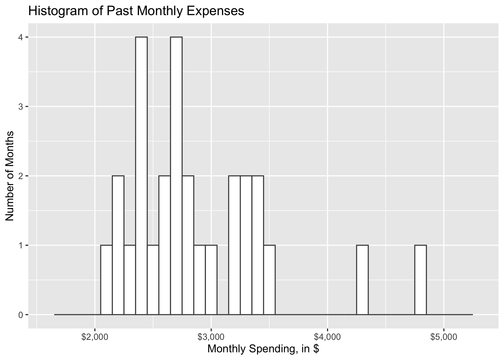

How much of my salary can I afford to donate to charity?
================
Alistair Clark
2019/12/30 (updated: 2020-02-21)

-----

It costs $2,196 to save a life.

That’s the latest estimate from
[GiveWell](https://www.givewell.org/giving101#footnote1_1dmjnp5), an
organization doing fantastic work measuring the impact of charitable
donations.

I’ve known that number for years, but I still find it hard to
consistently donate to charity. Why? Because life is unpredictable. It
seems like every month an unexpected expense pops up and derails my
budget – a last minute wedding gift, flights home for Christmas, or an
emergency vet bill. Add to that the need to save for retirement and the
daily cost of living in an expensive city like Vancouver, and it never
feels like there is enough left over to donate.

I’ve given to charity sporadically in the past, but once I graduate from
my Master’s program I want to make it a consistent habit. I’d like to
donate at least 10% of my salary, but I’m not confident I can afford it
without going over budget.

So the question is, how much can I afford to donate to charity each
year? I decided to run the numbers to find an answer.

Here are my priorities for this decision. I want to… 1) Maximize the
amount I can donate 2) Maintain my current savings level 3) Minimize the
risk of going over budget from unexpected expenses

## Step 1: Create a basic budget

I’ll start by creating a basic budget with some fixed values that will
not change as part of this analysis: my salary, taxes, and savings.

For simplicity, I’ll estimate an annual salary of $100,000. My spouse
and I are financially conservative, so I’ll put aside 25% into an RRSP,
or \\$25,000. Next, I’ll calculate my taxes using this online calculator
from SimpleTax. Taxes work out to $20,727 per year.

After taxes, and savings, I’m left with $54,273. This is the pool of
money I have available for daily living expenses and charitable
donations.

## Step 2: Estimate my monthly cost of living

In the classic approach to budgeting, my next step would be to continue
the waterfall chart and subtract fixed amounts for rent, groceries, gas,
internet, eating out, etc. Whatever is left would be the amount I can
contribute to charity.

Here’s a snapshot of my monthly expenses for the last 24 months.

The classic approach to budgeting would be to take the average of these
values, $2,886, and plug it into my budget. That would tell me how much
money I have available to donate to charity, but it ignores the inherent
uncertainty of my cost of living. - What if I have a few bad spending
months because all of my friends decide to get married in the same year?
- What if my car breaks down? - What if I lose my phone and need to
replace it?

If I’m really going to make an ongoing commitment to charity, I need a
budget that reflects the uncertainty of life. Luckily, there’s an
analysis technique tailor-made for making decisions under uncertain
conditions: Monte Carlo simulation.

In Monte Carlo models, not every variable has to be a single fixed
number. Instead, uncertain variables can take on a range of possible
numbers. For example, instead of saying “I WILL spend exactly $2,886 a
month” in a Monte Carlo model I can say “I don’t know how much I will
spend each month, but it’s probably between \\$2,000 and $5,000 and most
likely around \\$3,000.”

To apply Monte Carlo simulation to my budget, I need to turn the
“variable” that estimates my monthly expenses into a probability
distribution that represents a range of possible numbers and the
probability of each. After experimenting with various distributions, I
found that a log-normal distribution with a mean of 7.95 and standard
deviation of 0.19 is a good representation of my cost of living.

Now that I have this distribution, I can use it to simulate a year of
expenses by randomly selecting 12 numbers from the distribution.

## Step 3: Calculate my optimum donation level

Alright, I have everything I need to calculate how much I can afford to
donate. Each time I run my model it simulates one year of expenses and
returns how much I am over or under budget. For example, below is a
simulation of a single year where I donated 15% to charity. The x-axis
shows how much I am over or under budget, the black vertical line shows
the break even point, and the y-axis shows the number of years. The
green bar representshow much I was under budget in this one simulated
year.

But with Monte Carlo, I don’t just simulate one year. Instead, I
simulate thousands of years. The result is a visual of how often a
certain donation level results in being over or under budget. Here’s a
simulation of 10,000 years using the same 15% donation level.

Most years hover around $5,000 under budget, but they range quite a bit,
from around \\$3,000 over budget on the far left, to $10,000 under
budget on the far right. Out of 10,000 simulated years, only a few were
over budget (around 1%).

I’m financially conservative, so I want a donation level that results in
0% of years being over budget. To find that number I can re-run this
simulation at various donation levels.

After running multiple simulations, I found that **11% annual
donations** is the number that results in zero years going over budget.

That’s $11,000 donated to charity, or 5 lives saved per year.

I’m still on a student budget for now, but once I graduate I’ll rerun
this analysis to find exactly how much I can afford to donate\!
